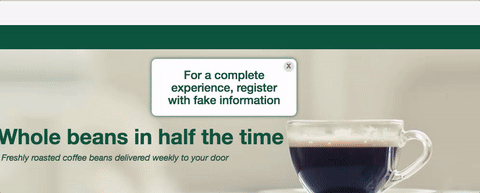

# Ecommerce Site Using Node, Express, MongoDB, and Angular. Full-Stack MEAN.

## Overview of Project

DC Roasters is an Ecommerce site that is built on the MEAN stack. Login in with fake information for the full experience. Select a coffee plan that fits, or create your own.

## Technologies, Frameworks, and Programming Languages userFound
<ul>
  <li>Jade for HTML, Sass for CSS, Javascript - I liked Jade and Sass's simplicity. I used CodeKit as my compiler throughout the project.</li>
  <li>AngularJS, AngularRoutes, AngularCookies - frontend logic to push/pull data</li>
  <li>Express.js & Node.js - my backend, which houses the custom API built for this project which gives us three objects to us: request(req), response (res), and next.</li>
  <li>Mongoose/MongoDB - Mongoose gives a bit of structure to this NoSQL database, which stores the data collected.</li>
  <li>Stripe - the payment feature in this at checkout that allows the use of credit cards.</li>
</ul>

## Challenges

With this being one of my first full-stack projects, there was a lot to do and only so much time to do it. This really pushed me in ways of prioritizing and simplifying the problem.

### Frontend

Getting familiar with Jade in this project was my top priority. I was introduced to it with a couple Express.js projects like my <a href="http://www.github.com/jttwnsnd/socket-chatroom">socket chatroom</a> and loved the simplicity of it. Though, getting used to how it's syntax worked is more understanding how to say it in Jade that what to say for my markup.

With Angular having data-binding, this was an obvious choice for the front-end. Ensuring that Angular knew everything going on in the backend first meant that I have to send everything to my backend from Angular. Inside my views that is bound through ng-view, provided by Angular Routes for an single page app, I would use ng-model in my HTML and reference it in my JS.

<code>
<input type="text" ng-model="username" placeholder="Enter Username" min-length="4" max-length="30" class="form-control"/>
</code>

## back-end is an api driven by Express and mongoDB in node.
